# :exclamation: 프로젝트 소개

##### 안녕하세요 팀 Del:eaT(DELivery+EAT) 입니다

### :raising_hand: 팀원소개

<table>
  <tr>
      <td align="center"><a href="https://github.com/positivehun/"><br /><sub><b>김지헌<br>Back-end, 팀장</b></sub></a><br /></td>      
      <td align="center"><a href="https://github.com/kky0455"><br /><sub><b>김광용<br>Back-end</b></sub></a><br /></td>      
      <td align="center"><a href="https://github.com/paneko3"><br /><sub><b>정재철<br>Back-end</b></sub></a><br /></td>
      <td align="center"><a href="https://github.com/abovenormal"><br /><sub><b>한세환<br>Back-end<br/></b></sub></a></td>
      <td align="center"><a href="https://github.com/Xsungmin"><br /><sub><b>김성민<br>Front-end,<br/>Application</b></sub></a><br /></td>
      <td align="center"><a href="https://github.com/hanggeee"><br /><sub><b>윤형준<br>Front-end,<br/>Web</b></sub></a><br /></td>

  </tr>
</table>

### :grey_exclamation: 긱허브(GeekHub) 서비스 소개

- #### 프로젝트명 : 긱허브(GeekHub)

- #### 진행 기간: 2022.08.29 ~ 2022.11.21

- #### 팀명: 딜리트(DEL:EAT)

- #### 목표: 배달긱 드라이버들의 업무 자동화 및 관리자 업무 모니터링 및 데이터 수집

- #### [긱허브 진행 내용 (by notion)](https://handy-beryllium-5b4.notion.site/07d2efefde7d407eb2ca911da5fa8f7d)

#### :sparkles: 서비스 특징

- ##### 바쁜 배달기사님들을 위한 배달업무 자동화 어플리케이션입니다.

- ##### NFC(Near Field Communication) 근거리 무선 통신을 이용하여, 자동 체크인과 배달완료 사진 업로드 과정을 한번의 과정을 통해 처리합니다.

- ##### T-Map API를 활용하여 위치, 경로 탐색, 네비게이션 연동 서비스를 제공합니다.

- ##### 관리자 페이지에선 각 지점의 배달 성공률, 배달기사님들의 사진 로그를 바탕으로 각 지점의 개별적 관리를 지원합니다.

## :bulb: 전체 서버 구조

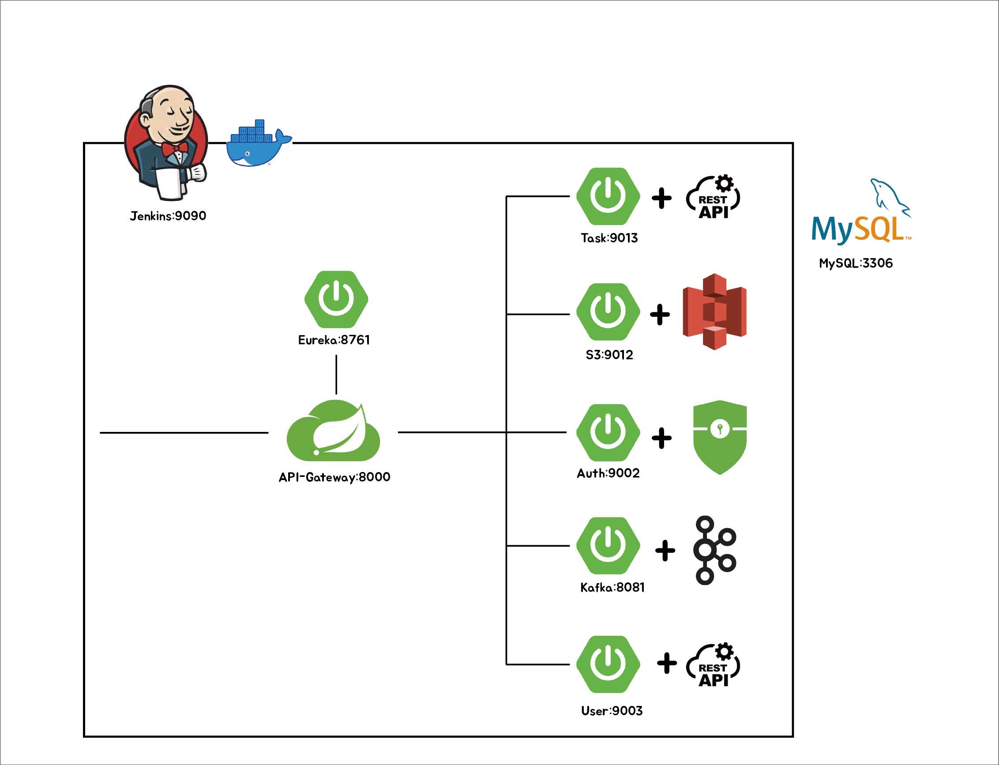

## :mega: 카프카 서버 구조


#### :point_right: 주요 기능

| 서비스          | 주요 기능                                                                                  |
| --------------- | ------------------------------------------------------------------------------------------ |
| NFC             | 핸드폰 근거리 통신으로 사진 촬영과 전송을 한번에 진행하여 시간을 단축합니다.               |
| 네비게이션      | T-map 오픈소스를 이용하여 기사님들의 현재 위치, 최단 경로, 그리고 네비게이션을 제공합니다. |
| 채팅            | STOMP를 활용하여 웹과 앱에서 실시간 채팅을 제공합니다.                                     |
| 실시간 모니터링 | 사진이 촬영, 전송되는 시점과 예상 도착 시점의 오차를 분석하여 도표로 제공합니다.           |
| 지난 로그 확인  | 저장된 기록들을 분석하여 지난 날의 성공,실패 확률을 원그래프로 제시해 줍니다.              |

## :notebook_with_decorative_cover: 페이지 소개

- #### 1. 관리자 페이지

  <br/>

  - #### 1.1 로그인 페이지

    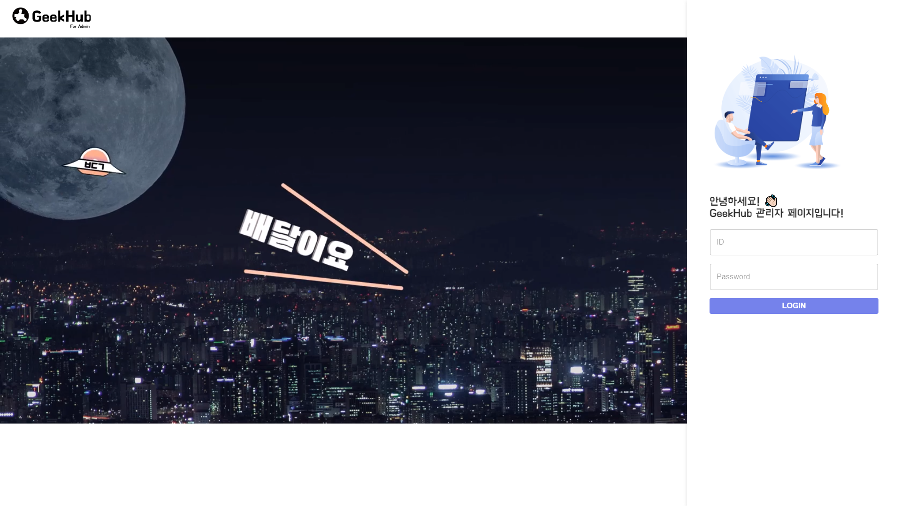
    <br/>

  - ##### 배달긱 홍보영상을 상시 재생하고 있습니다.
  - ##### 관리자로 임명된(ROLE) 아이디만 서비스에 접속할 수 있습니다.

  <br/>

  - #### 1.2 Overview(배달 요약) 페이지

    - ##### 배달현황을 간략하게 볼 수 있는 페이지입니다.
    - ##### 전국 지역과, 각 지역의 배달 성공 / 실패를 원 그래프로 확인할 수 있습니다.
    <br/>

  - #### 1.3 실시간 모니터링 페이지

    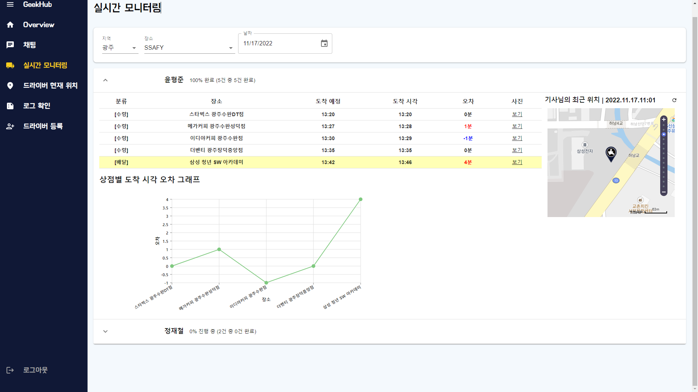
    <br/>

    - #### 지역, 장소, 시간 테이블, 날짜를 통해 현재 어떻게 배달이 진행되고 있는지 파악합니다.
    - #### 해당 지역의 기사의 현재 위치를 실시간으로 지도에 표시합니다.
    - #### 장소, 도착 예정 시각, 실제 도착 시각, 오차, 사진을 확인합니다.
    - #### 예정 시각과 도착 시각의 오차를 그래프를 통해 확인합니다.
    - #### 오차 시간이 5분이 넘어서 도착할 경우 관리자에게 알람이 울립니다.
    - #### 해당 날짜에 기록이 없을 시 '조회된 데이터가 없습니다'로 표시 됩니다.

    <br/>

  - #### 1.3 근무중인 배달기사 페이지

    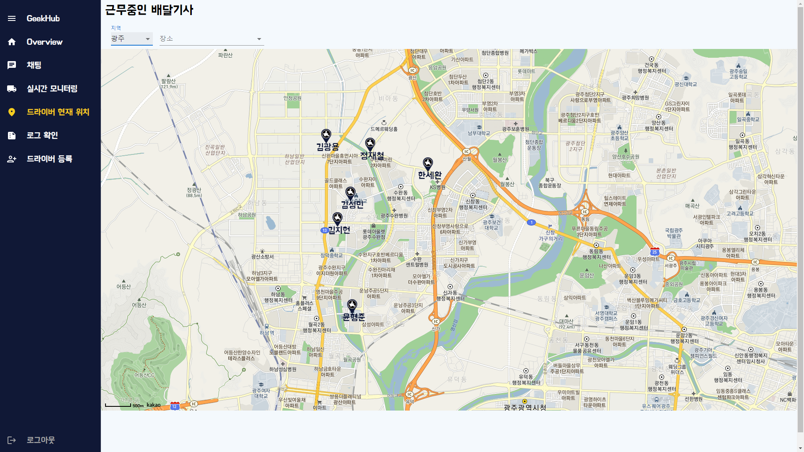
    <br/>

    - #### 해당 지역에 현재 근무하고 있는 기사만 지도상에 실시간으로 표시합니다.

    <br/>

  - #### 1.4 로그 확인 페이지

    
    <br/>

    - #### 배달 완료된 사진 기록을 확인 할 수 있습니다.
    - #### 기록된 GPS를 확인 할 수 있습니다.(전체 보기를 통해 그 날 기록된 기록을 확인 가능합니다.)
    <br/>

  - #### 1.5 채팅 페이지

    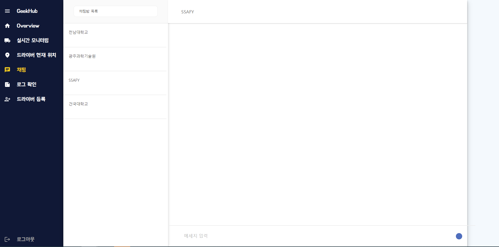
    <br/>

    - #### 관리자와 해당 지역에 있는 드라이버님들과 실시간 채팅이 가능합니다.
    - #### 웹과 앱에서 동시에 채팅이 가능합니다.
    <br/>

  - #### 1.6 신규 드라이버 등록 페이지

    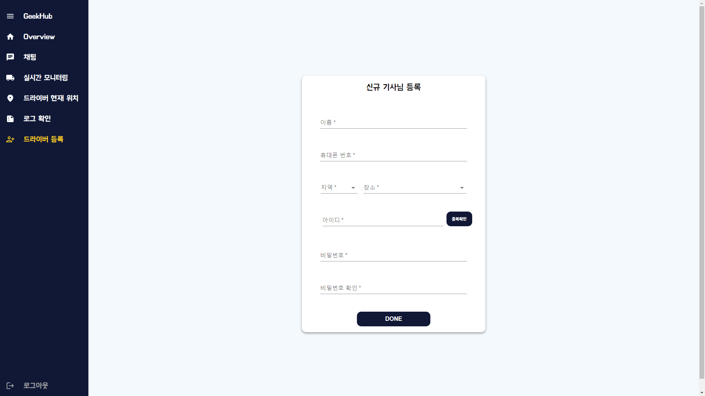
    <br/>

    - #### 배달기사의 신상정보(배달 지역, 시간)를 통해 아이디를 생성합니다.
    - #### 아이디 중복확인을 제공합니다.
    <br/>

- ### 2. GeekHub 앱

  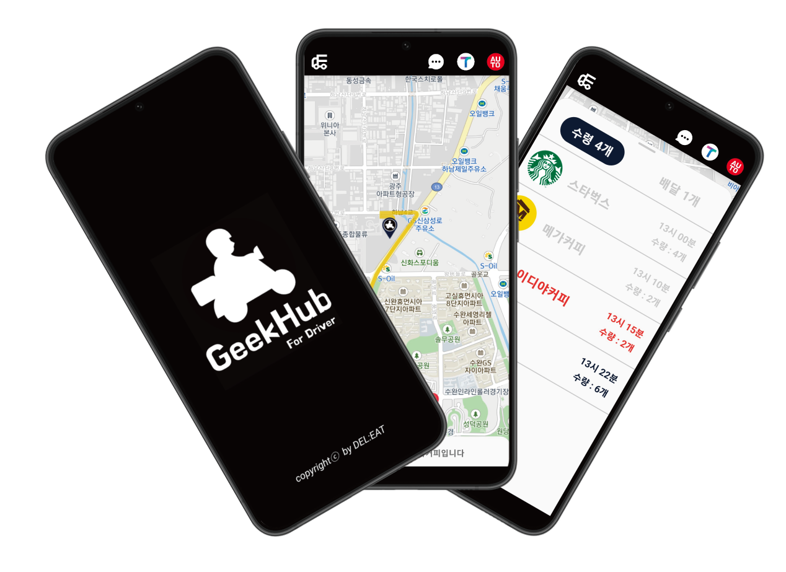
  <br/>

  - #### 2.1 로그인 화면

    - #### 관리자가 생성한 아이디로 앱에 로그인합니다.
    - #### 앱을 이용하기에 앞서 사용자에게 앱 사용 중 위치 공유 권환을 제공 받습니다.
    <br/>

  - #### 2.2 홈 화면

    - #### 지도 화면에선 현재 위치와 다음 배송지까지의 경로를 알려줍니다.
    - #### 로고를 클릭하게 되면 홈 화면으로 이동합니다.
    - #### 버튼을 클릭하면 현재 위치가 가운데로 오게 포커스를 맞추어 줍니다.
    - #### GPS가 매번 갱신 될 때 현재 위치로 자동으로 포커스를 맞추어 줍니다.
    - #### 네비게이션 기능이 필요할 때 티맵 앱으로 현재 위치와 다음 경로를 기준으로 안내해 줍니다.
    - #### 관리자와 현재 지역을 담당하는 배달기사님들 간의 채팅을 할 수 있습니다.
    - #### 화면 하단의 nav바를 슬라이드하면 픽업할 매장 목록과 배달지를 확인 가능합니다.

    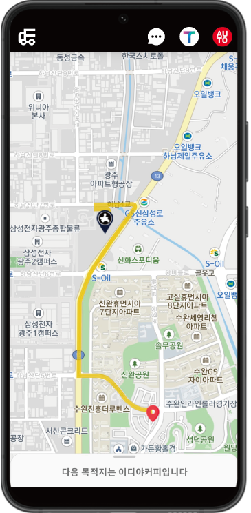
    <br/>

  - #### 2.3 픽업 목록 화면

    - #### 배달 물품 수령지와 배달지 목록을 확인할 수 있습니다.
    - #### 물품을 수령 해야할 매장, 시간, 물품 개수를 순서대로 확인합니다.
    - #### 해당 매장을 클릭하면 NFC 태킹 화면으로 이동합니다.
    - #### 이후 사진 촬영이 완료된 항목은 픽업 목록 화면에서 회색으로 변하게 됩니다.
    - #### 배달지 항목은 클릭 시 사진을 바로 촬영하여 배달을 완료하게 됩니다.

    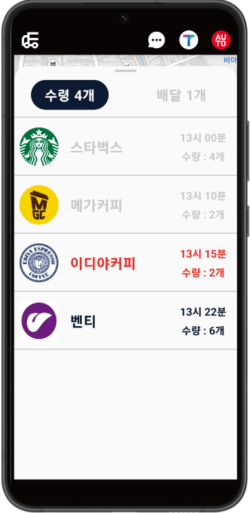
    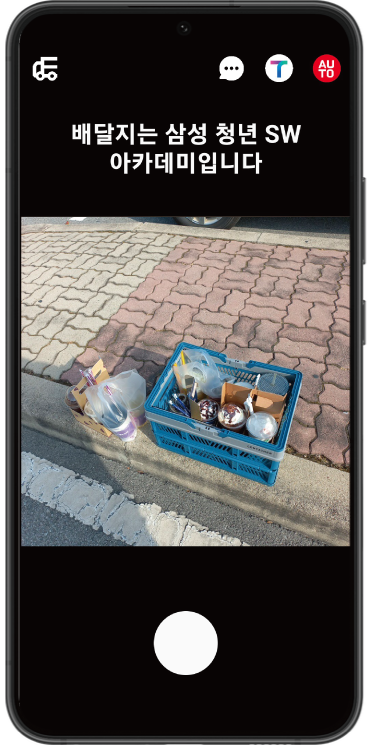
    <br/>

  - #### 2.4 NFC 태킹 화면

    - #### 사용하기에 앞서 사용자에게 NFC 사용여부를 판단하여 NFC를 키게 도와줍니다.
    - #### NFC 태그하고 사진 촬영 화면으로 이동합니다.
    - #### 사진 촬영이 완료된 후 재촬영 혹은 전송하기를 통해 다음 서비스로 이동합니다.

    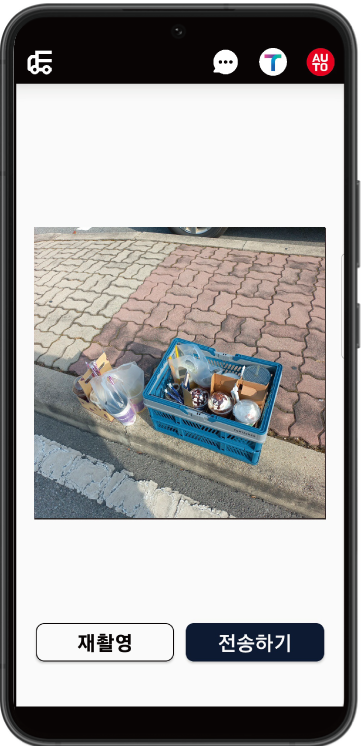

    <br/>

  - #### 2.4 채팅 화면

    - #### 웹과 실시간으로 채팅을 할 수 있습니다.

  <br/>

  - #### 2.5 배달 완료 화면

    - #### 사용자가 모든 업무를 완료했을 시 화면이 나타나며 서비스를 종료하게 됩니다.
    <br/>

## :wrench: 기술스택

### Frontend


<br />

### Android


<br />

### Backend

 


<br />

### DataBase

 
 <br />

### Server

 

<br />


 <br />

### **Version Control**


### **Issue Tracking System**

 <br />


## 실행방법

직접 빌드 하거나 [배포 사이트](http://k7c205.p.ssafy.io/)로 접속!!

#### Frontend

client 폴더 안에서 아래의 명령어를 실행합니다.

```
패키지 설치
$ npm install
```

```
프로젝트 실행
$ npm run dev
```

#### Backend <br/>

##### Spring <br />

GeekHub 폴더 안에서 아래의 명령어를 실행합니다.

```
jar 파일 빌드
$ ./gradlew build
```

```
빌드 파일 실행
(MSA 구조로 각 파일의 jar 파일을 실행)
각 폴더에서 이동 : build -> libs
$ java -jar *.jar(해당 폴더 안에 맞는 형식의 jar파일 실행)
```
